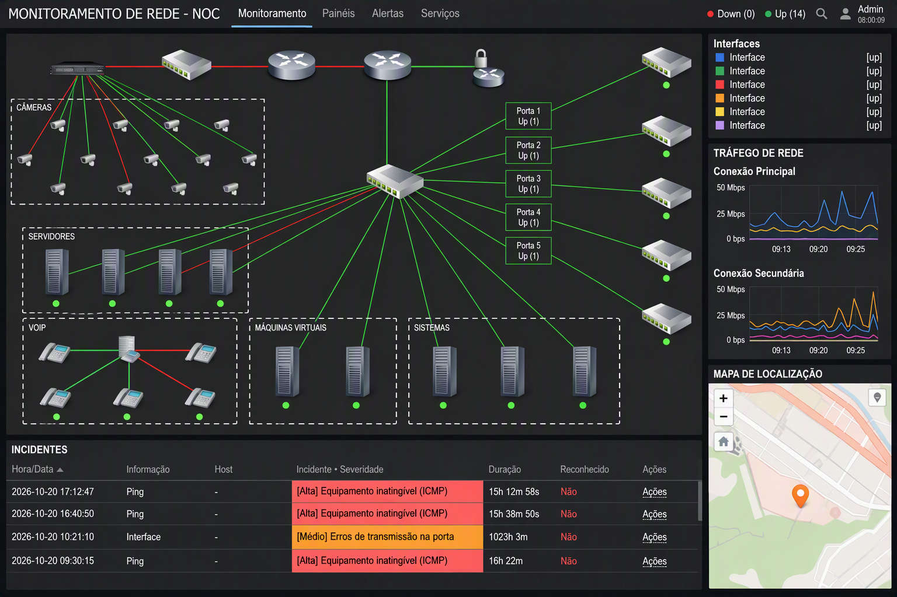

# 🛡️ Enterprise Network & Infrastructure Monitoring Center (NOC)

> **Contexto do Projeto:** Arquitetura de observabilidade e monitorização de missão crítica implementada para um Centro de Operações de Rede (NOC) num ambiente de grande escala, alta disponibilidade e rigorosos padrões de segurança.

---

## 📌 Visão Geral
Este repositório documenta o desenho e a implantação de um painel centralizado para monitorizar uma infraestrutura de TI híbrida e complexa. O ecossistema abrange toda a topologia de rede (switches core e de acesso, firewalls e gateways), servidores físicos, clusters de virtualização, telefonia IP (VoIP), sistemas corporativos essenciais e a rede de segurança física (CFTV).

---

## 🚀 Implantação e Infraestrutura do Sistema

Para garantir resiliência, fácil manutenção e rápida escalabilidade, o próprio ambiente de monitorização foi estruturado utilizando práticas modernas de DevOps:

* **Conteinerização (Docker Compose):** Todo o ecossistema da ferramenta de monitorização (Server, Banco de Dados, Agentes e Web) foi provisionado em contentores utilizando **Docker**, com a orquestração e gestão dos serviços definida via `docker-compose.yml`.
* **Servidor Web & Proxy (Nginx):** A interface gráfica (frontend) e os painéis de visualização foram servidos de forma otimizada, rápida e segura utilizando o **Nginx** como servidor web/proxy.

---

## 🏗️ Arquitetura e Ativos Monitorizados

O painel foi estruturado em camadas lógicas para fornecer visibilidade total e em tempo real da operação:

* **Topologia de Rede (Core & Acesso):** Mapeamento de gateways e switches em cascata, com monitorização de conectividade (ICMP) e análise de tráfego em tempo real para os links de internet (Conexão Principal e Secundária).
* **Servidores Físicos & Virtualização:** Controlo de saúde (health check), disponibilidade de hardware e monitorização de recursos em clusters de máquinas virtuais.
* **Sistemas e Aplicações Corporativas:** Acompanhamento ativo do estado de serviços internos e bases de dados essenciais para a operação da instituição.
* **Telecomunicações (VoIP):** Monitorização de centrais telefónicas e terminais IP distribuídos pelas instalações.
* **Segurança Física (CFTV):** Verificação contínua da disponibilidade de gravadores de vídeo (NVR) e câmaras de vigilância integradas na rede.

---

## 📊 Principais Funcionalidades Implementadas

* **Mapas de Topologia Dinâmicos:** Criação de dashboards visuais no Zabbix refletindo a árvore exata de dependências lógicas e físicas da infraestrutura.
* **Análise de Tráfego de Banda:** Gráficos interativos exibindo tráfego em Megabits por segundo (Mbps) e largura de banda consumida nas portas críticas.
* **Gestão de Incidentes em Tempo Real:** Tabela de alertas integrada com níveis de severidade automatizados (ex: *[Alta] Equipamento inatingível (ICMP)*, *[Médio] Erros de transmissão na porta*), registo de tempo de inatividade e estado de intervenção da equipa de suporte.

---

## 📸 Demonstração do Ambiente (Dashboard Executivo)

*Visão geral do painel operacional de infraestrutura:*

---

## 🛠️ Tecnologias e Ferramentas Utilizadas
* **Plataforma de Observabilidade:** Zabbix
* **Orquestração e Web:** Docker, Docker Compose, Nginx
* **Protocolos de Recolha de Dados:** SNMP (v2c/v3), ICMP (Ping), Zabbix Agent
* **Ativos Monitorizados:** Switches L2/L3, Servidores Rack, Gateways, NVRs, Telefonia IP
* **Ambientes:** Infraestrutura Física (Bare-metal) e Redes Virtualizadas

---
*Projeto documentado para demonstrar competências avançadas em administração de redes, conteinerização e sistemas de monitorização corporativa para centros de resposta a incidentes (NOC).*
